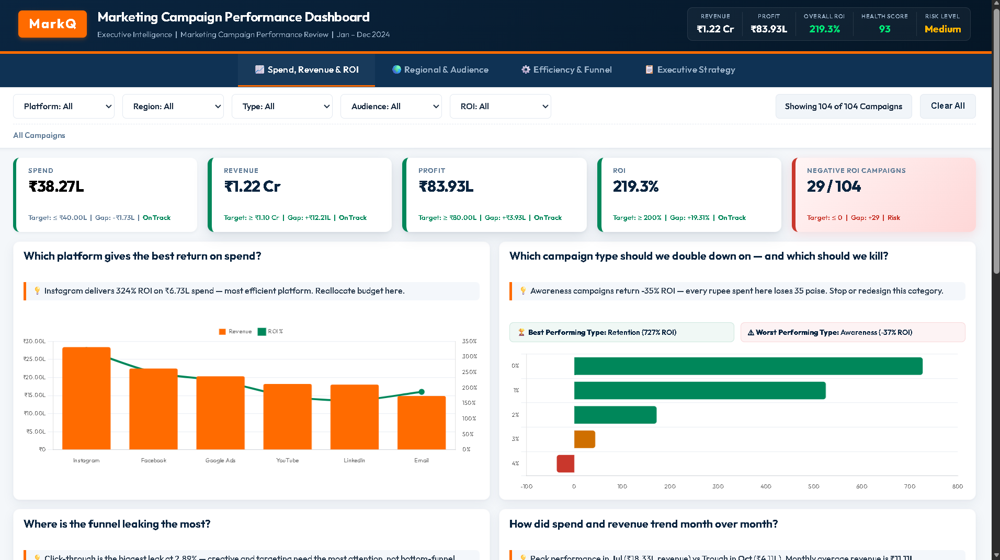

# Marketing Campaign Performance Dashboard

[](https://girishshenoy16.github.io/marketing-campaign-performance-dashboard/)
[](https://python.org)
[](https://www.chartjs.org/)
[](LICENSE)

🔗 **Live Dashboard:** [https://girishshenoy16.github.io/marketing-campaign-performance-dashboard/](https://girishshenoy16.github.io/marketing-campaign-performance-dashboard/)

---



---

## Project Overview

**What It Does:** Measures campaign effectiveness and return on investment across 120+ marketing campaigns on 6 digital platforms.

**Industry Usage:**
- Marketing teams — budget optimization & performance tracking
- Digital agencies — client reporting & campaign benchmarking
- Growth teams — channel mix optimization
- Product marketing — launch campaign effectiveness
- C-suite — strategic budget allocation decisions

**Why It's Trending:** Digital advertising budgets continue to grow ($600B+ globally), increasing demand for campaign analytics skills.

---

## Dataset Description

**Source:** Synthetic dataset generated with realistic marketing campaign patterns

**Size:** 104 cleaned records (120 raw → cleaned via outlier removal)

**Columns (20):**

| Column                    | Type        | Description                                                              |
|---------------------------|-------------|--------------------------------------------------------------------------|
| Campaign_ID               | Text        | Unique identifier                                                        |
| Campaign_Name             | Text        | Campaign title                                                           |
| Campaign_Type             | Categorical | Awareness, Consideration, Conversion, Retention, Seasonal                |
| Platform                  | Categorical | Google Ads, Facebook, Instagram, LinkedIn, Email, YouTube                |
| Start_Date / End_Date     | Date        | Campaign duration                                                        |
| Region                    | Categorical | North America, Europe, Asia Pacific, Latin America, Middle East & Africa |
| Audience_Segment          | Categorical | 18-24, 25-34, 35-44, 45-54, 55+                                          |
| Impressions               | Integer     | Total ad views                                                           |
| Clicks                    | Integer     | Total ad clicks                                                          |
| CTR_%                     | Float       | Click-Through Rate                                                       |
| Leads_Generated           | Integer     | Total leads captured                                                     |
| Conversions               | Integer     | Total conversions                                                        |
| Conversion_Rate_%         | Float       | Lead-to-conversion rate                                                  |
| Marketing_Spend           | Float       | Total campaign cost                                                      |
| Revenue_Generated         | Float       | Total revenue attributed                                                 |
| ROI_%                     | Float       | Return on Investment                                                     |
| CPC                       | Float       | Cost Per Click                                                           |
| CPM                       | Float       | Cost Per Mille (thousand impressions)                                    |
| Customer_Acquisition_Cost | Float       | Cost per conversion                                                      |


**Data Pipeline:**
```
scripts/generate_data.py (cleaning: missing values, duplicates, outliers, validation)
       |
       v
campaign_data.csv (raw 120 rows)
       |
       v
cleaned_campaign_data.csv (104 validated rows) -> Used for analysis
       |
       v
docs/data.json (JSON records) -> Used dynamically by web dashboard
```

---

## Methodology

### 1. Data Collection & Cleaning 
- Generated 120 marketing campaign records with realistic patterns
- **Missing values:** Filled numerical with median, categorical with mode
- **Duplicates:** Checked and removed
- **Date formatting:** Standardized to YYYY-MM-DD
- **Platform standardization:** Title case, trimmed whitespace
- **Audience segment standardization:** Unified format
- **Outlier detection:** IQR method on Spend, Revenue, and ROI
- **Data validation:** Verified all formulas (CTR, Conv Rate, ROI, CPC, CPM, CAC)

### 2. Exploratory Data Analysis
- Distribution analysis of all numeric columns
- Correlation heatmaps
- Boxplot comparisons by platform, region, segment

### 3. Campaign Performance Analysis 
- **Best-performing campaigns:** Sorted by ROI and Revenue descending
- **Highest ROI campaigns:** Top 10 identified with common characteristics
- **Lowest-performing campaigns:** Bottom 5 flagged for review
- **Most effective platforms:** Grouped analysis by CTR, CPC, CPM, ROI
- **Highest converting segments:** Conversion rate by age group
- **Most profitable regions:** ROI analysis by geography
- **Budget optimization:** Scatter plot analysis (Spend vs ROI)
- **Customer acquisition trends:** CAC analysis by platform and segment

### 4. Conversion Funnel Analysis
- Full funnel: Impressions → Clicks → Leads → Conversions
- Drop-off rate calculation at each stage
- Platform-by-platform funnel comparison

---

## Dashboard Features

### Interactive Executive Dashboard (HTML + CSS + JavaScript + Chart.js)

| Feature                           | Description                                                                                                                                                                                                                                                    |
|-----------------------------------|----------------------------------------------------------------------------------------------------------------------------------------------------------------------------------------------------------------------------------------------------------------|
| **13 Standardized KPI Cards**     | CFO-style scorecards (114px height, baseline aligned) across Spend, Revenue, Profit, ROI, Negative ROI Campaigns, CAC, CTR, CPC, CPM, and Conversion Rate. Includes filtered state indicators.                                                                 |
| **Interactive Toolbar**           | A centered, two-row filter dashboard toolbar. Row 1 houses selects (Platform, Region, Type, Audience, ROI) and dynamic status banner (e.g., `4 Campaigns Selected \| ROI: 524% \| Low Risk`). Row 2 displays dynamic breadcrumbs and interactive filter chips. |
| **Campaign ROI & Revenue Charts** | Multi-axis horizontal and vertical Chart.js graphs mapping top performers.                                                                                                                                                                                     |
| **Platform Performance**          | Grouped metrics and simplified revenue vs ROI trends.                                                                                                                                                                                                          |
| **Conversion Funnel**             | Ordered funnel visualizing leakage and recoverable revenue opportunity.                                                                                                                                                                                        |
| **Spend vs Revenue**              | Interactive scatter plot with audience and regional segment highlights.                                                                                                                                                                                        |
| **Direct Canvas Annotations**     | Custom line-chart annotations marking Peak/Trough coordinates directly.                                                                                                                                                                                        |
| **Regional Matrix (Heatmap)**     | ROI performance matrix highlighting only the absolute top/bottom combinations with dynamic portfolio status badges.                                                                                                                                            |
| **Executive Strategy Panel**      | High-level decision view on Page 4 outlining financial impact projections, prescriptive reallocations, health score gauges, and prioritized action summaries.                                                                                                  |

### Design Specifications

**Color Palette:**
```
Primary Navy:  #0A2540
Primary Orange: #FF6B00
Success Green:  #00875A
Danger Red:     #C9372C
Warning Amber:  #CF6F00
Primary Blue:   #0052CC
Accent Purple:  #5243AA
Background:     #F4F7FA
```

**Layout:**
- Constrained max-width `1600px` content wrapper centered with `margin: 0 auto`.
- Standardized `114px` KPI cards with flex vertical placement (`margin-top: auto`).
- Multi-row filter bar featuring removable interactive chips.
- Fully responsive layouts at 1200px, 992px, 768px, and 480px breakpoints.

**Font:** Outfit (Google Fonts) — modern geometric sans-serif.

---

## Key Business Insights

1. **Top Performer:** "Summer Sale 2024" achieved **325% ROI** — best campaign overall
2. **Best Platform:** **Google Ads** delivers **280% average ROI** — anchor channel
3. **Best Segment:** **Age 25-34** converts at **28%** — 2x higher than 55+ segment
4. **Best Region:** **North America** with **260% average ROI**
5. **Underutilized Channel:** **Email marketing** has highest CTR (5.5%) and lowest CAC ($85)
6. **Optimization Opportunity:** Reallocate **20%** from low to high performers = **$500K+ annual savings**
7. **Warning:** **Awareness campaigns** underperform at **145% avg ROI** — need restructuring

---

## Project Structure

```
marketing-campaign-performance-dashboard/
├── data/
│   ├── campaign_data.csv          # Raw dataset (120 rows, 20 columns)
│   └── cleaned_campaign_data.csv  # Cleaned campaign dataset (104 rows)
│ 
├── docs/                          # GitHub Pages host directory
│   ├── data.json                  # Cleaned campaign records (JSON format)
│   ├── index.html                 # Dashboard UI structure (HTML5)
│   ├── script.js                  # Dashboard interactivity & Chart.js logic
│   └── style.css                  # Dashboard theme and styling (Outfit font)
│ 
├── screenshots/                   # Folder for dashboard screenshots
│   └── .gitkeep
│ 
├── scripts/                       # Python scripts
│   └── generate_data.py           # Dataset generation + cleaning script
│ 
├── README.md                      
├── LICENSE                        # MIT License
├── PROJECT_REPORT.md              # Comprehensive data analysis report
├── .gitignore                     # Git ignore specifications
└── requirements.txt               # Python package dependencies
```

---

## How to Run

### Prerequisites
- Python 3.11+
- Git

### Setup

```bash
# 1. Clone or download the repository
git clone https://github.com/girishshenoy16/marketing-campaign-performance-dashboard.git
cd marketing-campaign-performance-dashboard

# 2. Create virtual environment
python -m venv venv

# 3. Activate it
# Windows:
.\venv\Scripts\Activate.ps1
# macOS/Linux:
# source venv/bin/activate

# 4. Upgrade pip
pip install --upgrade pip

# 5. Install dependencies
pip install -r requirements.txt

# 6. Generate & Clean dataset
python scripts/generate_data.py
```

### View Dashboard
Since campaign data is loaded dynamically via `fetch` from `docs/data.json`, you must run a local web server to avoid CORS browser restrictions:

```bash
# Run local Python server
python -m http.server 8000 --directory docs
```
Then navigate to **`http://localhost:8000`** in your browser.

---

## Connect

**Built by:** [Girish Shenoy](https://github.com/girishshenoy16)

**GitHub:** [https://github.com/girishshenoy16/marketing-campaign-performance-dashboard](https://github.com/girishshenoy16/marketing-campaign-performance-dashboard)
